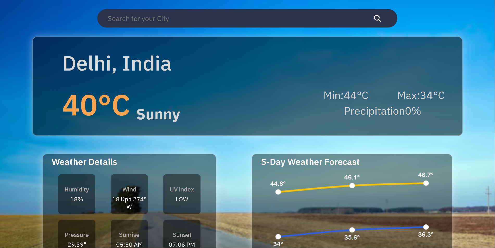
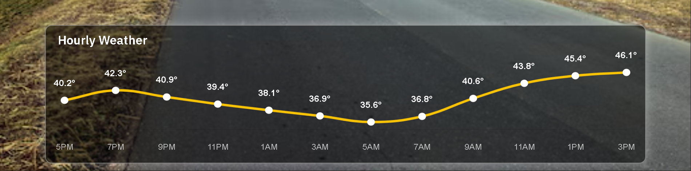

# 🌦️ Weatherly — Modern Weather Forecast Web App

<div align="center">


### ✨ A sleek and responsive weather forecasting application with modern UI, animated charts, and real-time weather insights.

</div>

---

# 📸 Preview

<div align="center">




</div>

---

# 🚀 Features

## 🌍 Real-Time Weather Data
- Search weather for any city
- Live temperature updates
- Current weather conditions
- Dynamic weather information

## 📊 Interactive Charts
- 5-day weather forecast
- Hourly weather graph
- Smooth Chart.js visualizations
- Responsive graph design
- Mobile-friendly scrolling charts

## 🎨 Modern UI/UX
- Glassmorphism design
- Responsive layout
- Dynamic backgrounds
- Smooth weather cards
- Mobile optimized interface

## ☀️ Detailed Weather Information
- Humidity
- Wind Speed
- Pressure
- UV Index
- Sunrise & Sunset
- Rain Probability
- Max/Min Temperatures

---

# 🛠️ Tech Stack

| Technology | Usage |
|---|---|
| HTML5 | Structure |
| CSS3 | Styling & Responsive Design |
| JavaScript | Functionality |
| WeatherAPI | Weather Data |
| Chart.js | Graphs & Forecast Charts |
| RapidAPI | API Gateway |

---

# 📂 Project Structure

```bash
Weather-App/
│
├── index.html
├── style.css
├── script.js
├── graph.js
├── hourly-graph.js
├── weather_api.js
├── config.js
├── public/
│   ├── rain.jpg
│   └── clear.avif
│   ├── default.jpg
│   ├── clear-night.jpg
│   ├── cloudy_night.jpg
│
└── README.md
```

---

# ⚡ Installation & Setup

## 1️⃣ Clone Repository

```bash
git clone https://github.com/your-username/weather-app.git
```

## 2️⃣ Open Project Folder

```bash
cd weather-app
```

## 3️⃣ Add API Key

Create a `config.js` file:

```javascript
export const API_KEY = "YOUR_API_KEY";
```

## 4️⃣ Run Project

Use VS Code Live Server or open `index.html`.

---

# 🔑 API Used

## WeatherAPI

This project uses:

- Current Weather API
- Forecast API
- Hourly Forecast API

Powered through RapidAPI.

---

# 📱 Responsive Design

The app is fully responsive for:

✅ Desktop
✅ Tablets
✅ Mobile Devices

---

# 📈 Graph Features

## 3-Day Forecast Graph
- Max temperature line
- Min temperature line
- Dynamic labels
- Smooth curves

## Hourly Weather Graph
- Rolling 24-hour forecast
- Real-time hourly temperatures
- Mobile scrolling graph
- Dynamic AM/PM labels

---

# 🎯 Future Improvements

- 🌍 Geolocation support
- 🌙 Dark/Light theme toggle
- 🌧️ Weather animations
- 📅 Weekly forecasts
- 🔔 Weather alerts
- 🗺️ Interactive weather maps
- 🌡️ Unit conversion (°C / °F)

---

# 💡 Learning Outcomes

This project helped in learning:

- API integration
- ES6 Modules
- Async/Await
- DOM Manipulation
- Responsive Design
- Chart.js Integration
- Mobile-first UI
- Git & GitHub workflow

---

# 🤝 Contributing

Contributions are welcome.

1. Fork the repository
2. Create a new branch
3. Commit changes
4. Push changes
5. Open a Pull Request

---

# 📜 License

This project is open source and available under the MIT License.

---

# 👨‍💻 Author

### Om Handa

- GitHub: https://github.com/Om-Handa

---

<div align="center">

## ⭐ If you like this project, give it a star ⭐

Made with ❤️ using HTML, CSS & JavaScript

</div>

